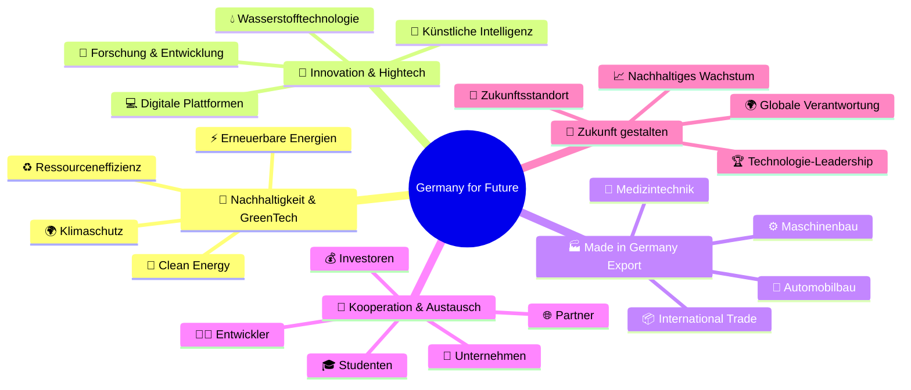
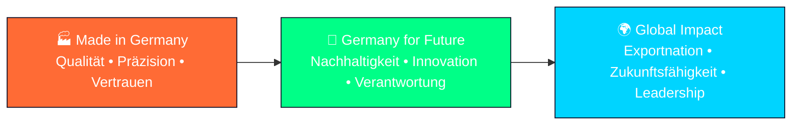

# 🇩🇪 Germany for Future – The Beginning

<div align="center">

```ascii
 ██████╗ ███████╗██████╗ ███╗   ███╗ █████╗ ███╗   ██╗██╗   ██╗    ███████╗ ██████╗ ██████╗     ███████╗██╗   ██╗████████╗██╗   ██╗██████╗ ███████╗
██╔════╝ ██╔════╝██╔══██╗████╗ ████║██╔══██╗████╗  ██║╚██╗ ██╔╝    ██╔════╝██╔═══██╗██╔══██╗    ██╔════╝██║   ██║╚══██╔══╝██║   ██║██╔══██╗██╔════╝
██║  ███╗█████╗  ██████╔╝██╔████╔██║███████║██╔██╗ ██║ ╚████╔╝     █████╗  ██║   ██║██████╔╝    █████╗  ██║   ██║   ██║   ██║   ██║██████╔╝█████╗  
██║   ██║██╔══╝  ██╔══██╗██║╚██╔╝██║██╔══██║██║╚██╗██║  ╚██╔╝      ██╔══╝  ██║   ██║██╔══██╗    ██╔══╝  ██║   ██║   ██║   ██║   ██║██╔══██╗██╔══╝  
╚██████╔╝███████╗██║  ██║██║ ╚═╝ ██║██║  ██║██║ ╚████║   ██║       ██║     ╚██████╔╝██║  ██║    ██║     ╚██████╔╝   ██║   ╚██████╔╝██║  ██║███████╗
 ╚═════╝ ╚══════╝╚═╝  ╚═╝╚═╝     ╚═╝╚═╝  ╚═╝╚═╝  ╚═══╝   ╚═╝       ╚═╝      ╚═════╝ ╚═╝  ╚═╝    ╚═╝      ╚═════╝    ╚═╝    ╚═════╝ ╚═╝  ╚═╝╚══════╝
```


<table align="center">
<tr>
<td align="center">

</td>
<td align="center">

</td>
<td align="center">

</td>
</tr>
<tr>
<td align="center">

</td>
<td align="center">

</td>
<td align="center">

</td>
</tr>
</table>

### 🎯 **Der Startschuss für eine neue Bewegung deutscher Exzellenz**
*Nachhaltigkeit • Innovation • Verantwortung • Zukunft*

</div>

---

## 🌟 Germany for Future – The Beginning

> **Germany for Future ist unser Startschuss – The Beginning – für eine neue Bewegung, die deutsche Exzellenz, Nachhaltigkeit und Innovation weltweit sichtbar machen will.**

Dieses Projekt verbindet die **Werte von Made in Germany** mit einer klaren **Zukunftsorientierung**: **Qualität**, **Technologie** und **Verantwortung für kommende Generationen**.

<div align="center">


</div>

## 💡 Unsere Ausgangsidee

Deutschland steht für **Qualität**, **Ingenieurskunst** und **internationale Wettbewerbsfähigkeit**. Mit **Germany for Future** wollen wir diese Stärken neu interpretieren und auf Zukunftsfelder übertragen.

### 🎯 **Im Fokus stehen:**

<div align="center">



</div>

<table>
<tr>
<td width="50%">

#### 🌱 **Nachhaltigkeit & GreenTech**
Lösungen für **Klimaschutz**, **erneuerbare Energien** und **Ressourceneffizienz**.

#### 🚀 **Innovation & Hightech**
Von **Künstlicher Intelligenz** über **Wasserstofftechnologie** bis **digitale Plattformen**.

#### 🏭 **Made in Germany Export**
Deutsche Produkte, **Maschinenbau**, **Medizintechnik** und **Automobilbau** international sichtbar machen.

</td>
<td width="50%">

#### 🤝 **Kooperation & Austausch**
**Unternehmen**, **Entwickler**, **Studenten**, **Investoren** und **Partner** vernetzen.

#### 🔮 **Zukunft gestalten**
Deutschland als führenden **Standort für Technologie** und **Verantwortung** etablieren.

</td>
</tr>
</table>

---

## 🎭 Warum „The Beginning"?

<div align="center">

### 🌟 **Weil wir hier noch am Anfang stehen**

</div>

Dieses Repository ist **kein fertiges Produkt**, sondern die **Basis für eine Vision**, die wachsen wird. Wir dokumentieren hier **erste Gedanken**, **Konzepte** und **Leitideen**, die später zu **Projekten**, **Plattformen** und **Initiativen** ausgebaut werden können.

<details>
<summary><strong>🔍 Was bedeutet "The Beginning" konkret?</strong></summary>

**So entsteht Schritt für Schritt eine zukunftsorientierte Bewegung Made in Germany, die über Landesgrenzen hinaus wirkt.**

- 📋 **Dokumentation** erster Visionen und Konzepte
- 🌱 **Organisches Wachstum** durch Community-Beiträge  
- 🔄 **Iterative Entwicklung** von Ideen zu Realität
- 🌍 **Internationale Ausstrahlung** deutscher Innovationskraft
- 🤝 **Kollaborative Plattform** für alle Stakeholder

</details>

---

## 🏆 Germany for Future & Made in Germany

<table>
<tr>
<td width="60%">

### 🎯 **Unser Anspruch**

Unser Anspruch ist, die **weltweite Bedeutung von Made in Germany** nicht nur zu bewahren, sondern **weiterzuentwickeln**. 

**Qualität**, **Präzision** und **Vertrauen** treffen auf **Nachhaltigkeit**, **Innovationskraft** und **globale Verantwortung**. 

Damit schaffen wir ein **Fundament**, das Deutschland als **Exportnation** auch in **Zukunft erfolgreich** macht.

</td>
<td width="40%">

<div align="center">


</div>

</td>
</tr>
</table>

### 🔄 **Die Evolution von Made in Germany**



---

## 🤝 Einladung zur Mitgestaltung

<div align="center">

### 🌟 **Zukunft entsteht nicht im Alleingang**

</div>

Deshalb laden wir **alle ein**, die **Ideen**, **Visionen** oder **konkrete Projekte** einbringen möchten – ob **Studenten**, **Entwickler**, **Unternehmen**, **politische Entscheider** oder **Investoren**. 

**Jeder Beitrag hilft, das Projekt zu stärken.**

<table align="center">
<tr>
<td align="center" width="20%">

<h4>🎓 Studenten</h4>
<p><em>Frische Ideen & Forschung</em></p>
</td>
<td align="center" width="20%">

<h4>👨‍💻 Entwickler</h4>
<p><em>Technische Innovation</em></p>
</td>
<td align="center" width="20%">

<h4>🏢 Unternehmen</h4>
<p><em>Industrielle Expertise</em></p>
</td>
<td align="center" width="20%">

<h4>🏛️ Politik</h4>
<p><em>Strategische Führung</em></p>
</td>
<td align="center" width="20%">

<h4>💰 Investoren</h4>
<p><em>Finanzielle Unterstützung</em></p>
</td>
</tr>
</table>

### 🎯 **Wie Du beitragen kannst:**

<details>
<summary><strong>🎓 Für Studenten & Forscher</strong></summary>

- 📚 **Wissenschaftliche Beiträge** zu Nachhaltigkeitstechnologien
- 💡 **Innovative Projektideen** für die Zukunft Deutschlands
- 🔬 **Forschungserkenntnisse** zu GreenTech und CleanTech
- 🌐 **Internationale Perspektiven** auf deutsche Innovation

</details>

<details>
<summary><strong>👨‍💻 Für Entwickler & Tech-Experten</strong></summary>

- 💻 **Digitale Plattformen** für nachhaltige Technologien
- 🤖 **KI-Lösungen** für Umwelt und Industrie
- 📱 **Apps und Tools** für GreenTech-Anwendungen
- ☁️ **Cloud-Infrastrukturen** für deutsche Exporteure

</details>

<details>
<summary><strong>🏢 Für Unternehmen & Industrie</strong></summary>

- 🏭 **Best Practice Beispiele** aus der deutschen Industrie
- 🌱 **Nachhaltigkeitsinitiativen** und CSR-Projekte
- 📦 **Exporterfahrungen** und internationale Erfolgsgeschichten
- ⚡ **Technologiepartnerschaften** für Innovation

</details>

<details>
<summary><strong>🏛️ Für politische Entscheider</strong></summary>

- 📋 **Politische Rahmenbedingungen** für Nachhaltigkeit
- 🌍 **Internationale Kooperationen** und Handelsabkommen
- 💼 **Förderprogram­me** für GreenTech und Innovation
- 🎯 **Strategische Ziele** für Deutschland als Zukunftsstandort

</details>

<details>
<summary><strong>💰 Für Investoren & Partner</strong></summary>

- 💡 **Investment-Opportunitäten** in deutsche Zukunftstechnologien
- 📈 **Marktanalysen** und Wachstumspotentiale
- 🤝 **Strategische Partnerschaften** für internationale Expansion
- 🌱 **ESG-Investments** und nachhaltige Finanzierung

</details>

---

## 🚀 The Beginning – Werde Teil der Bewegung

<div align="center">

### 👉 **Germany for Future – The Beginning ist die Einladung, Teil von etwas Größerem zu werden**

**Gemeinsam können wir ein modernes, nachhaltiges und starkes Bild von Deutschland entwickeln – für die Märkte, für die Menschen und für die Zukunft.**

<table>
<tr>
<td align="center">

</td>
<td align="center">

</td>
<td align="center">

</td>
</tr>
</table>

</div>

---

## 📌 Footer – Germany for Future

<div align="center">

### 🌟 **Germany for Future – The Beginning**

</div>

**Germany for Future – The Beginning** ist der **Startpunkt für eine neue Plattform**, die **Nachhaltigkeit**, **Innovation** und **Zukunft aus Deutschland** sichtbar macht. Dieses Repository liefert **Basisinformationen**, **Leitlinien** und **Inspiration**, die später mit dem Projekt **Made in Germany** verbunden werden können.

Wir möchten **Unternehmen**, **Entwickler**, **Studierende**, **Investoren** und **internationale Partner** einladen, gemeinsam an den Themen **Zukunft**, **Export**, **Green Economy** und **digitale Transformation** zu arbeiten.

### 🎯 Warum das wichtig ist

Deutschland steht seit Jahrzehnten für **Qualität**, **Innovation** und **nachhaltige Entwicklung**. Im **globalen Wettbewerb** sind **Export**, **International Trade**, **Technologie** und **Klimaschutz** zentrale Faktoren. 

Mit **Germany for Future** schaffen wir eine **Basis für Kooperationen**, **Austausch** und **neue Geschäftsmodelle**, die **international Wirkung** entfalten können.

---

## 🔍 Unsere Kernthemen

<div align="center">

### 📊 **SEO-relevante Schwerpunkte**

<table>
<tr>
<td width="50%">

#### 🌍 **Made in Germany** 
- Qualität, Vertrauen, Herkunft

#### ♻️ **Nachhaltigkeit**
- Ökologische Verantwortung, Zukunftsfähigkeit

#### 🚀 **Innovation**
- Forschung, Digitalisierung, Hightech

#### 📦 **Export & International Trade**
- Globale Märkte, Handelschancen

#### 🔋 **Green Economy**
- Erneuerbare Energien, Umwelttechnologien

#### 🏭 **Industrie 4.0**
- Automatisierung, Smart Manufacturing

#### 🔗 **Supply Chain**
- Transparenz, Effizienz, globale Lieferketten

#### 📈 **Investitionen in die Zukunft**
- Wachstum, Partnerschaften

</td>
<td width="50%">

#### 📜 **Qualität & Zertifizierungen**
- Standards, Vertrauen, Sicherheit

#### 🧑‍🎓 **Wissenschaft & Forschung**
- Hochschulen, Talente, Wissenstransfer

#### 💡 **Digitale Transformation**
- Software, KI, Plattformen

#### 🤝 **Kooperationen & Partnerschaften**
- Netzwerke, Innovation Hubs

#### 🌱 **Future of Work**
- Bildung, Skills, Arbeitswelten

#### 📊 **Wirtschaft & Wachstum**
- Neue Märkte, Chancen, Stabilität

#### 🔮 **Germany for Future Vision**
- Inspiration, Ideenschmiede, Zukunftsbilder

</td>
</tr>
</table>

</div>

---

## 🌐 Unsere Digitale Präsenz

<div align="center">

### 🔗 **Germany for Future Plattformen**

<table>
<tr>
<td align="center" width="50%">
<a href="https://germany-for-future.com">

</a>
</td>
<td align="center" width="50%">
<a href="https://the-beginning.germany-for-future.com">

</a>
</td>
</tr>
<tr>
<td align="center" width="50%">
<a href="https://innovation.germany-for-future.com">

</a>
</td>
<td align="center" width="50%">
<a href="https://greentech.germany-for-future.com">

</a>
</td>
</tr>
</table>

### 🔗 **Made in Germany Integration**

<table>
<tr>
<td align="center" width="50%">
<a href="https://made-in-germany.global">

</a>
</td>
<td align="center" width="50%">
<a href="https://export.made-in-germany.global">

</a>
</td>
</tr>
<tr>
<td align="center" width="50%">
<a href="https://future.made-in-germany.global">

</a>
</td>
<td align="center" width="50%">
<a href="https://sustainability.made-in-germany.global">

</a>
</td>
</tr>
</table>

### 🏭 **Branchenspezifische Domains**

<table>
<tr>
<td align="center" width="33%">
<a href="https://maschinenbau.germany-for-future.com">

</a>
</td>
<td align="center" width="33%">
<a href="https://medtech.germany-for-future.com">

</a>
</td>
<td align="center" width="33%">
<a href="https://automotive.germany-for-future.com">

</a>
</td>
</tr>
<tr>
<td align="center" width="33%">
<a href="https://hydrogen.germany-for-future.com">

</a>
</td>
<td align="center" width="33%">
<a href="https://ai.germany-for-future.com">

</a>
</td>
<td align="center" width="33%">
<a href="https://renewable.germany-for-future.com">

</a>
</td>
</tr>
</table>

### 🎓 **Community & Entwickler Plattformen**

<table>
<tr>
<td align="center" width="50%">
<a href="https://developers.germany-for-future.com">

</a>
</td>
<td align="center" width="50%">
<a href="https://students.germany-for-future.com">

</a>
</td>
</tr>
<tr>
<td align="center" width="50%">
<a href="https://research.germany-for-future.com">

</a>
</td>
<td align="center" width="50%">
<a href="https://startups.germany-for-future.com">

</a>
</td>
</tr>
</table>

### 💼 **Business & Investment Domains**

<table>
<tr>
<td align="center" width="50%">
<a href="https://invest.germany-for-future.com">

</a>
</td>
<td align="center" width="50%">
<a href="https://partnerships.germany-for-future.com">

</a>
</td>
</tr>
<tr>
<td align="center" width="50%">
<a href="https://export.germany-for-future.com">

</a>
</td>
<td align="center" width="50%">
<a href="https://trade.germany-for-future.com">

</a>
</td>
</tr>
</table>

</div>

---

## 📞 Beteiligung & Kontakt

<div align="center">

### 🤝 **Werde Teil der Community**

<table>
<tr>
<td align="center">

</td>
<td align="center">

</td>
</tr>
<tr>
<td align="center">

</td>
<td align="center">

</td>
</tr>
</table>

### 📧 **Direkte Kontaktkanäle**

```yaml
🔹 Allgemeine Anfragen:
  - 📧 contact@germany-for-future.com
  - 📧 info@germany-for-future.com
  - 🌐 https://germany-for-future.com/contact

🔹 The Beginning Initiative:
  - 📧 beginning@germany-for-future.com
  - 🚀 https://the-beginning.germany-for-future.com
  - 💬 Discord: germany-for-future-beginning

🔹 Business & Partnerships:
  - 📧 business@germany-for-future.com
  - 🤝 partners@germany-for-future.com
  - 💰 invest@germany-for-future.com

🔹 Innovation & Tech:
  - 📧 innovation@germany-for-future.com
  - 👨‍💻 developers@germany-for-future.com
  - 🔬 research@germany-for-future.com

🔹 Community & Events:
  - 📧 community@germany-for-future.com
  - 🎓 students@germany-for-future.com
  - 🎪 events@germany-for-future.com

🔹 Presse & Medien:
  - 📧 press@germany-for-future.com
  - 📰 media@germany-for-future.com
  - 🎤 interviews@germany-for-future.com
```

### 📋 **Kontaktmöglichkeiten**

- 💡 **Beiträge und Impulse** sind willkommen
- 🌍 **Kooperationen und Partnerschaften** können hier entstehen  
- 📩 **Kontakt** über die Plattformen von **Made in Germany** und **Germany for Future**
- 🔗 **Domain-Portfolio** für verschiedene Fachbereiche verfügbar

</div>

---

## ⚠️ Wichtiger Hinweis

<div align="center">

### 🔄 **Dieses Projekt befindet sich im Aufbau**

**Es geht um Vision, Inspiration und erste Schritte – nicht um fertige Lösungen.**


</div>

---

<div align="center">


### 🌟 **„Die Zukunft beginnt heute – Gestalte sie mit uns!"** 🌟

**🌱 Nachhaltigkeit trifft Innovation | Deutschland gestaltet die Zukunft 🇩🇪**

*The Beginning of a sustainable, innovative and strong Germany*

---

**🎯 Bereit für The Beginning?**  
*Deine Vision • Unsere Plattform • Gemeinsame Zukunft*


**© 2024 Germany for Future – The Beginning | Vision • Inspiration • Erste Schritte**

</div>
