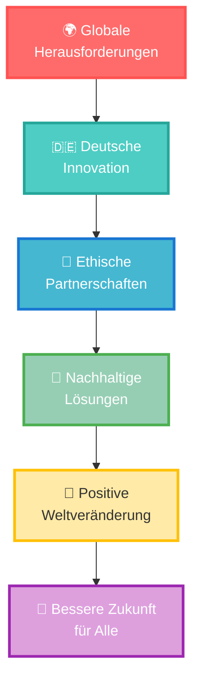

# 🌍 Germany for Future
## *Nachhaltige Innovation & Ethische Technologie*

<div align="center">

```
 ██████╗ ███████╗██████╗ ███╗   ███╗ █████╗ ███╗   ██╗██╗   ██╗
██╔════╝ ██╔════╝██╔══██╗████╗ ████║██╔══██╗████╗  ██║╚██╗ ██╔╝
██║  ███╗█████╗  ██████╔╝██╔████╔██║███████║██╔██╗ ██║ ╚████╔╝ 
██║   ██║██╔══╝  ██╔══██╗██║╚██╔╝██║██╔══██║██║╚██╗██║  ╚██╔╝  
╚██████╔╝███████╗██║  ██║██║ ╚═╝ ██║██║  ██║██║ ╚████║   ██║   
 ╚═════╝ ╚══════╝╚═╝  ╚═╝╚═╝     ╚═╝╚═╝  ╚═╝╚═╝  ╚═══╝   ╚═╝   
                                                                 
███████╗ ██████╗ ██████╗     ███████╗██╗   ██╗████████╗██╗   ██╗██████╗ ███████╗
██╔════╝██╔═══██╗██╔══██╗    ██╔════╝██║   ██║╚══██╔══╝██║   ██║██╔══██╗██╔════╝
█████╗  ██║   ██║██████╔╝    █████╗  ██║   ██║   ██║   ██║   ██║██████╔╝█████╗  
██╔══╝  ██║   ██║██╔══██╗    ██╔══╝  ██║   ██║   ██║   ██║   ██║██╔══██╗██╔══╝  
██║     ╚██████╔╝██║  ██║    ██║     ╚██████╔╝   ██║   ╚██████╔╝██║  ██║███████╗
╚═╝      ╚═════╝ ╚═╝  ╚═╝    ╚═╝      ╚═════╝    ╚═╝    ╚═════╝ ╚═╝  ╚═╝╚══════╝
```

<table>
<tr>
<td align="center">


</td>
<td align="center">


</td>
<td align="center">


</td>
<td align="center">


</td>
</tr>
</table>

---

### 🎯 **Nachhaltigkeit • Innovation • Ethik – Made in Germany**
*Where German Engineering Excellence Meets Global Responsibility*

</div>

---

## 🌟 VISION 2030 | TECHNOLOGIE FÜR EINE BESSERE WELT

> **Germany for Future** ist mehr als eine Plattform – es ist eine **Revolution**. Wir verbinden deutsche Ingenieurskunst mit ethischer Verantwortung und schaffen Technologien, die Umwelt, Gesundheit und Menschheit nachhaltig stärken.

<div align="center">

### 🚀 **Visionär & Gründer**
## Andreas Thommen
*Pionier für Nachhaltigkeit & Ethische Innovation*

</div>

---

## ⚡ KERN-MISSION | CORE ARCHITECTURE

<div align="center">



</div>

### 💡 **Die Zukunft verlangt nach Verantwortung**
Germany for Future gibt Innovationen eine Plattform, die mehr als Profit im Blick haben. Wir glauben daran, dass **Technologie der Menschheit dienen sollte** – nicht umgekehrt.

---

## 🎯 SCHWERPUNKTE | TRANSFORMATION DOMAINS

<table>
<tr>
<td width="25%" align="center">

### 🌊 **Umweltschutz**
**Meeresschutz-Initiativen**
- Ozeanreinigung-Tech
- Mikroplastik-Filter
- Marine Biodiversität

**Recycling-Revolution**
- Circular Economy
- Material Recovery
- Zero-Waste Production

</td>
<td width="25%" align="center">

### 🏥 **Medizin-Innovation**
**KI-Zellregeneration**
- Regenerative Medizin
- Personalisierte Therapie
- Präzisionsmedizin

**Globale Gesundheit**
- Remote Diagnostik
- Telemedizin-Infrastruktur
- Präventiv-Technologien

</td>
<td width="25%" align="center">

### 🔬 **Forschung & Entwicklung**
**Forschungskooperationen**
- Cross-Border Innovation
- Open-Source Wissenschaft
- Interdisziplinäre Teams

**Nachhaltige Produktion**
- Industrie 4.0 Green
- Carbon-Neutral Systems
- Smart Manufacturing

</td>
<td width="25%" align="center">

### 🤝 **Ethisches Netzwerk**
**Stakeholder-Ökosystem**
- Ethische Unternehmer
- Nachhaltigkeits-Forscher
- Impact-Investoren

**Werte-Partnerschaften**
- ESG-Compliance
- Transparenz-Tools
- Langzeit-Nachhaltigkeit

</td>
</tr>
</table>

---

## 🌟 PLATFORM ARCHITECTURE | NEXT-GEN TECHNOLOGY STACK

<div align="center">

```yaml
🔹 NACHHALTIGKEITS-ENGINE:
   Environmental Impact Tracking • Carbon Analytics • Sustainability Algorithms
   Real-time Environmental Data • Climate Impact Modeling • Green Tech Optimization

🔹 INNOVATION-HUB:
   Collaborative Research Platform • Open Innovation Marketplace • Patent Network
   Cross-industry Knowledge Transfer • AI-Powered Research Matching • Global Lab Network

🔹 ETHIK-FRAMEWORK:
   Responsible AI Guidelines • Ethical Decision Systems • Transparency Tools
   Social Impact Measurement • Values Alignment Check • Accountability Protocols

🔹 GLOBAL NETWORK:
   Multi-stakeholder Collaboration • Partnership Management • Cultural Bridge Tech
   Localized Impact Assessment • International Compliance • Cross-border Innovation
```

</div>

---

## 🚀 WARUM GERMANY FOR FUTURE?

<table>
<tr>
<td align="center" width="25%">

### 🌍 **Globale Verantwortung**
Deutsche Ingenieurskunst mit ethischen Prinzipien für weltweite positive Auswirkungen

</td>
<td align="center" width="25%">

### 💡 **Innovation mit Zweck**
Technologien, die echte Probleme lösen und nachhaltige Werte schaffen

</td>
<td align="center" width="25%">

### 🤝 **Kollaborative Kraft**
Vernetzung von Pionieren, die gemeinsam die Welt verändern wollen

</td>
<td align="center" width="25%">

### 📊 **Messbare Wirkung**
Transparente Erfolgs- und Impact-Metriken für alle Projekte

</td>
</tr>
</table>

---

## 🌱 MITMACHEN | JOIN THE REVOLUTION

<table>
<tr>
<td width="25%">

### **🔬 Für Innovatoren**
```bash
# Innovation teilen
git clone germany-for-future/
innovation-platform

# Ethische Tech-Community
npm install @gff/
sustainable-toolkit
```

</td>
<td width="25%">

### **🏢 Für Unternehmen**
1. **Bewerten** → ESG-Impact Assessment
2. **Entwickeln** → Nachhaltige Lösungen
3. **Skalieren** → Globale Auswirkungen

</td>
<td width="25%">

### **💰 Für Investoren**
1. **Entdecken** → Impact-Investments
2. **Evaluieren** → Nachhaltigkeits-ROI
3. **Investieren** → Weltverbessernde Tech

</td>
<td width="25%">

### **🎓 Für Forscher**
1. **Kollaborieren** → Interdisziplinäre Projekte
2. **Publizieren** → Open-Access Plattform
3. **Implementieren** → Praxis-Transfer

</td>
</tr>
</table>

---

## 📊 IMPACT DASHBOARD | UNSERE WIRKUNG

<div align="center">

| **BEREICH** | **AKTUELLE PROJEKTE** | **IMPACT METRIKEN** | **ZIEL 2030** |
|:-----------:|:---------------------:|:-------------------:|:--------------:|
| 🌊 **Umweltschutz** | `15+ Projekte` | `2.3M Tonnen CO₂ gespart` | **Carbon Neutral Ecosystem** |
| 🏥 **Gesundheit** | `8+ Innovationen` | `50K+ Leben verbessert` | **Global Health Equity** |
| 🔬 **Forschung** | `25+ Kooperationen` | `100+ Open-Source Patents` | **Knowledge Democracy** |
| 🤝 **Netzwerk** | `200+ Partner` | `50+ Länder` | **Worldwide Ethical Alliance** |

</div>

---

## 📞 KONTAKT | DIE ZUKUNFT GESTALTEN

<div align="center">

### 🌐 **PLATFORM**
## [germanyforfuture.org](https://germanyforfuture.org)

### 📧 **ZUKUNFT GESTALTEN**  
## zukunft@germanyforfuture.org

---


</div>

---

# 🌍 Germany for Future
## *Sustainable Innovation & Ethical Technology*

<div align="center">

### 🎯 **Sustainability • Innovation • Ethics – Made in Germany**
*Wo Deutsche Ingenieurskunst auf Globale Verantwortung trifft*

</div>

---

## 🌟 MISSION 2030 | TECHNOLOGY FOR A BETTER WORLD

> **Germany for Future** is more than a platform – it's a **revolution**. We connect German engineering excellence with ethical responsibility, creating technologies that sustainably strengthen environment, health, and humanity.

<div align="center">

### 🚀 **Visionary & Founder**
## Andreas Thommen
*Pioneer for Sustainability & Ethical Innovation*

</div>

---

## 💡 **The Future Demands Responsibility**
Germany for Future provides a platform for innovations that have more than profit in sight. We believe **technology should serve humanity** – not the other way around.

---

## 🎯 FOCUS AREAS | TRANSFORMATION DOMAINS

<table>
<tr>
<td width="25%" align="center">

### 🌊 **Environmental Protection**
**Ocean Protection Initiatives**
- Ocean Cleaning Tech
- Microplastic Filtration
- Marine Biodiversity

**Recycling Revolution**
- Circular Economy
- Material Recovery
- Zero-Waste Production

</td>
<td width="25%" align="center">

### 🏥 **Medical Innovation**
**AI Cell Regeneration**
- Regenerative Medicine
- Personalized Therapy
- Precision Medicine

**Global Health**
- Remote Diagnostics
- Telemedicine Infrastructure
- Preventive Technologies

</td>
<td width="25%" align="center">

### 🔬 **Research & Development**
**Research Cooperations**
- Cross-Border Innovation
- Open-Source Science
- Interdisciplinary Teams

**Sustainable Production**
- Industry 4.0 Green
- Carbon-Neutral Systems
- Smart Manufacturing

</td>
<td width="25%" align="center">

### 🤝 **Ethical Network**
**Stakeholder Ecosystem**
- Ethical Entrepreneurs
- Sustainability Researchers
- Impact Investors

**Values Partnerships**
- ESG Compliance
- Transparency Tools
- Long-term Sustainability

</td>
</tr>
</table>

---

## 🚀 WHY GERMANY FOR FUTURE?

<table>
<tr>
<td align="center" width="25%">

### 🌍 **Global Responsibility**
German engineering excellence with ethical principles for worldwide positive impact

</td>
<td align="center" width="25%">

### 💡 **Innovation with Purpose**
Technologies that solve real problems and create sustainable value

</td>
<td align="center" width="25%">

### 🤝 **Collaborative Power**
Connecting pioneers who want to change the world together

</td>
<td align="center" width="25%">

### 📊 **Measurable Impact**
Transparent success and impact metrics for all projects

</td>
</tr>
</table>

---

## 🌱 GET INVOLVED | MITMACHEN

<table>
<tr>
<td width="25%">

### **🔬 For Innovators**
```bash
# Share innovation
git clone germany-for-future/
innovation-platform

# Ethical tech community
npm install @gff/
sustainable-toolkit
```

</td>
<td width="25%">

### **🏢 For Companies**
1. **Assess** → ESG Impact Assessment
2. **Develop** → Sustainable Solutions
3. **Scale** → Global Impact

</td>
<td width="25%">

### **💰 For Investors**
1. **Discover** → Impact Investments
2. **Evaluate** → Sustainability ROI
3. **Invest** → World-Improving Tech

</td>
<td width="25%">

### **🎓 For Researchers**
1. **Collaborate** → Interdisciplinary Projects
2. **Publish** → Open-Access Platform
3. **Implement** → Practice Transfer

</td>
</tr>
</table>

---

## 📊 IMPACT DASHBOARD | OUR EFFECT

<div align="center">

| **DOMAIN** | **CURRENT PROJECTS** | **IMPACT METRICS** | **GOAL 2030** |
|:----------:|:--------------------:|:------------------:|:--------------:|
| 🌊 **Environment** | `15+ Projects` | `2.3M Tons CO₂ Saved` | **Carbon Neutral Ecosystem** |
| 🏥 **Health** | `8+ Innovations` | `50K+ Lives Improved` | **Global Health Equity** |
| 🔬 **Research** | `25+ Cooperations` | `100+ Open-Source Patents` | **Knowledge Democracy** |
| 🤝 **Network** | `200+ Partners` | `50+ Countries` | **Worldwide Ethical Alliance** |

</div>

---

## 📞 CONTACT | SHAPE THE FUTURE

<div align="center">

### 🌐 **PLATFORM**
## [germanyforfuture.org](https://germanyforfuture.org)

### 📧 **SHAPE THE FUTURE**  
## zukunft@germanyforfuture.org

---


</div>

---

<div align="center">

## 🌟 **Building Tomorrow's World Today**
## **Die Welt von Morgen Heute Bauen** 🌟

### *Technology with Conscience | Technologie mit Gewissen*

**"Die Zukunft gehört denen, die heute verantwortlich handeln"**  
*"The future belongs to those who act responsibly today"*

---

[](https://germanyforfuture.org)
[]()
[]()

</div>
