# 🇩🇪 Germany for Future – The Beginning

<div align="center">

```ascii
 ██████╗ ███████╗██████╗ ███╗   ███╗ █████╗ ███╗   ██╗██╗   ██╗    ███████╗ ██████╗ ██████╗     ███████╗██╗   ██╗████████╗██╗   ██╗██████╗ ███████╗
██╔════╝ ██╔════╝██╔══██╗████╗ ████║██╔══██╗████╗  ██║╚██╗ ██╔╝    ██╔════╝██╔═══██╗██╔══██╗    ██╔════╝██║   ██║╚══██╔══╝██║   ██║██╔══██╗██╔════╝
██║  ███╗█████╗  ██████╔╝██╔████╔██║███████║██╔██╗ ██║ ╚████╔╝     █████╗  ██║   ██║██████╔╝    █████╗  ██║   ██║   ██║   ██║   ██║██████╔╝█████╗  
██║   ██║██╔══╝  ██╔══██╗██║╚██╔╝██║██╔══██║██║╚██╗██║  ╚██╔╝      ██╔══╝  ██║   ██║██╔══██╗    ██╔══╝  ██║   ██║   ██║   ██║   ██║██╔══██╗██╔══╝  
╚██████╔╝███████╗██║  ██║██║ ╚═╝ ██║██║  ██║██║ ╚████║   ██║       ██║     ╚██████╔╝██║  ██║    ██║     ╚██████╔╝   ██║   ╚██████╔╝██║  ██║███████╗
 ╚═════╝ ╚══════╝╚═╝  ╚═╝╚═╝     ╚═╝╚═╝  ╚═╝╚═╝  ╚═══╝   ╚═╝       ╚═╝      ╚═════╝ ╚═╝  ╚═╝    ╚═╝      ╚═════╝    ╚═╝    ╚═════╝ ╚═╝  ╚═╝╚══════╝
```


<table align="center">
<tr>
<td align="center">

</td>
<td align="center">

</td>
<td align="center">

</td>
</tr>
<tr>
<td align="center">

</td>
<td align="center">

</td>
<td align="center">

</td>
</tr>
</table>

### 🎯 **Der Startschuss für eine neue Bewegung deutscher Exzellenz**
*Nachhaltigkeit • Innovation • Verantwortung • Zukunft*

</div>

---

## 🌟 Germany for Future – The Beginning

> **Germany for Future ist unser Startschuss – The Beginning – für eine neue Bewegung, die deutsche Exzellenz, Nachhaltigkeit und Innovation weltweit sichtbar machen will.**

Dieses Projekt verbindet die **Werte von Made in Germany** mit einer klaren **Zukunftsorientierung**: **Qualität**, **Technologie** und **Verantwortung für kommende Generationen**.

<div align="center">


</div>

## 💡 Unsere Ausgangsidee

Deutschland steht für **Qualität**, **Ingenieurskunst** und **internationale Wettbewerbsfähigkeit**. Mit **Germany for Future** wollen wir diese Stärken neu interpretieren und auf Zukunftsfelder übertragen.

### 🎯 **Im Fokus stehen:**

```mermaid
mindmap
  root((Germany for Future))
    🌱 Nachhaltigkeit & GreenTech
      🌍 Klimaschutz
      ⚡ Erneuerbare Energien
      ♻️ Ressourceneffizienz
      🔋 Clean Energy
    🚀 Innovation & Hightech
      🤖 Künstliche Intelligenz
      💧 Wasserstofftechnologie
      💻 Digitale Plattformen
      🔬 Forschung & Entwicklung
    🏭 Made in Germany Export
      ⚙️ Maschinenbau
      🏥 Medizintechnik
      🚗 Automobilbau
      📦 International Trade
    🤝 Kooperation & Austausch
      🏢 Unternehmen
      👨‍💻 Entwickler
      🎓 Studenten
      💰 Investoren
      🌐 Partner
    🔮 Zukunft gestalten
      🏆 Technologie-Leadership
      🌍 Globale Verantwortung
      📈 Nachhaltiges Wachstum
      🎯 Zukunftsstandort
```

<div align="center">



</div>

<table>
<tr>
<td width="50%">

#### 🌱 **Nachhaltigkeit & GreenTech**
Lösungen für **Klimaschutz**, **erneuerbare Energien** und **Ressourceneffizienz**.

#### 🚀 **Innovation & Hightech**
Von **Künstlicher Intelligenz** über **Wasserstofftechnologie** bis **digitale Plattformen**.

#### 🏭 **Made in Germany Export**
Deutsche Produkte, **Maschinenbau**, **Medizintechnik** und **Automobilbau** international sichtbar machen.

</td>
<td width="50%">

#### 🤝 **Kooperation & Austausch**
**Unternehmen**, **Entwickler**, **Studenten**, **Investoren** und **Partner** vernetzen.

#### 🔮 **Zukunft gestalten**
Deutschland als führenden **Standort für Technologie** und **Verantwortung** etablieren.

</td>
</tr>
</table>

---

## 🎭 Warum „The Beginning"?

<div align="center">

### 🌟 **Weil wir hier noch am Anfang stehen**

</div>

Dieses Repository ist **kein fertiges Produkt**, sondern die **Basis für eine Vision**, die wachsen wird. Wir dokumentieren hier **erste Gedanken**, **Konzepte** und **Leitideen**, die später zu **Projekten**, **Plattformen** und **Initiativen** ausgebaut werden können.

<details>
<summary><strong>🔍 Was bedeutet "The Beginning" konkret?</strong></summary>

**So entsteht Schritt für Schritt eine zukunftsorientierte Bewegung Made in Germany, die über Landesgrenzen hinaus wirkt.**

- 📋 **Dokumentation** erster Visionen und Konzepte
- 🌱 **Organisches Wachstum** durch Community-Beiträge  
- 🔄 **Iterative Entwicklung** von Ideen zu Realität
- 🌍 **Internationale Ausstrahlung** deutscher Innovationskraft
- 🤝 **Kollaborative Plattform** für alle Stakeholder

</details>

---

## 🏆 Germany for Future & Made in Germany

<table>
<tr>
<td width="60%">

### 🎯 **Unser Anspruch**

Unser Anspruch ist, die **weltweite Bedeutung von Made in Germany** nicht nur zu bewahren, sondern **weiterzuentwickeln**. 

**Qualität**, **Präzision** und **Vertrauen** treffen auf **Nachhaltigkeit**, **Innovationskraft** und **globale Verantwortung**. 

Damit schaffen wir ein **Fundament**, das Deutschland als **Exportnation** auch in **Zukunft erfolgreich** macht.

</td>
<td width="40%">

<div align="center">


</div>

</td>
</tr>
</table>

### 🔄 **Die Evolution von Made in Germany**

```mermaid
graph LR
    A[🏭 Made in Germany<br/>Qualität • Präzision • Vertrauen] --> B[🌱 Germany for Future<br/>Nachhaltigkeit • Innovation • Verantwortung]
    B --> C[🌍 Global Impact<br/>Exportnation • Zukunftsfähigkeit • Leadership]
    
    style A fill:#FF6B35,stroke:#0A0E27,color:#fff
    style B fill:#00FF87,stroke:#0A0E27,color:#fff  
    style C fill:#00D4FF,stroke:#0A0E27,color:#fff
```



---

## 🤝 Einladung zur Mitgestaltung

<div align="center">

### 🌟 **Zukunft entsteht nicht im Alleingang**

</div>

Deshalb laden wir **alle ein**, die **Ideen**, **Visionen** oder **konkrete Projekte** einbringen möchten – ob **Studenten**, **Entwickler**, **Unternehmen**, **politische Entscheider** oder **Investoren**. 

**Jeder Beitrag hilft, das Projekt zu stärken.**

<table align="center">
<tr>
<td align="center" width="20%">

<h4>🎓 Studenten</h4>
<p><em>Frische Ideen & Forschung</em></p>
</td>
<td align="center" width="20%">

<h4>👨‍💻 Entwickler</h4>
<p><em>Technische Innovation</em></p>
</td>
<td align="center" width="20%">

<h4>🏢 Unternehmen</h4>
<p><em>Industrielle Expertise</em></p>
</td>
<td align="center" width="20%">

<h4>🏛️ Politik</h4>
<p><em>Strategische Führung</em></p>
</td>
<td align="center" width="20%">

<h4>💰 Investoren</h4>
<p><em>Finanzielle Unterstützung</em></p>
</td>
</tr>
</table>

### 🎯 **Wie Du beitragen kannst:**

<details>
<summary><strong>🎓 Für Studenten & Forscher</strong></summary>

- 📚 **Wissenschaftliche Beiträge** zu Nachhaltigkeitstechnologien
- 💡 **Innovative Projektideen** für die Zukunft Deutschlands
- 🔬 **Forschungserkenntnisse** zu GreenTech und CleanTech
- 🌐 **Internationale Perspektiven** auf deutsche Innovation

</details>

<details>
<summary><strong>👨‍💻 Für Entwickler & Tech-Experten</strong></summary>

- 💻 **Digitale Plattformen** für nachhaltige Technologien
- 🤖 **KI-Lösungen** für Umwelt und Industrie
- 📱 **Apps und Tools** für GreenTech-Anwendungen
- ☁️ **Cloud-Infrastrukturen** für deutsche Exporteure

</details>

<details>
<summary><strong>🏢 Für Unternehmen & Industrie</strong></summary>

- 🏭 **Best Practice Beispiele** aus der deutschen Industrie
- 🌱 **Nachhaltigkeitsinitiativen** und CSR-Projekte
- 📦 **Exporterfahrungen** und internationale Erfolgsgeschichten
- ⚡ **Technologiepartnerschaften** für Innovation

</details>

<details>
<summary><strong>🏛️ Für politische Entscheider</strong></summary>

- 📋 **Politische Rahmenbedingungen** für Nachhaltigkeit
- 🌍 **Internationale Kooperationen** und Handelsabkommen
- 💼 **Förderprogram­me** für GreenTech und Innovation
- 🎯 **Strategische Ziele** für Deutschland als Zukunftsstandort

</details>

<details>
<summary><strong>💰 Für Investoren & Partner</strong></summary>

- 💡 **Investment-Opportunitäten** in deutsche Zukunftstechnologien
- 📈 **Marktanalysen** und Wachstumspotentiale
- 🤝 **Strategische Partnerschaften** für internationale Expansion
- 🌱 **ESG-Investments** und nachhaltige Finanzierung

</details>

---

## 🚀 The Beginning – Werde Teil der Bewegung

<div align="center">

### 👉 **Germany for Future – The Beginning ist die Einladung, Teil von etwas Größerem zu werden**

**Gemeinsam können wir ein modernes, nachhaltiges und starkes Bild von Deutschland entwickeln – für die Märkte, für die Menschen und für die Zukunft.**

<table>
<tr>
<td align="center">

</td>
<td align="center">

</td>
<td align="center">

</td>
</tr>
</table>

</div>

---

## 📌 Footer – Germany for Future

<div align="center">

### 🌟 **Germany for Future – The Beginning**

</div>

**Germany for Future – The Beginning** ist der **Startpunkt für eine neue Plattform**, die **Nachhaltigkeit**, **Innovation** und **Zukunft aus Deutschland** sichtbar macht. Dieses Repository liefert **Basisinformationen**, **Leitlinien** und **Inspiration**, die später mit dem Projekt **Made in Germany** verbunden werden können.

Wir möchten **Unternehmen**, **Entwickler**, **Studierende**, **Investoren** und **internationale Partner** einladen, gemeinsam an den Themen **Zukunft**, **Export**, **Green Economy** und **digitale Transformation** zu arbeiten.

### 🎯 Warum das wichtig ist

Deutschland steht seit Jahrzehnten für **Qualität**, **Innovation** und **nachhaltige Entwicklung**. Im **globalen Wettbewerb** sind **Export**, **International Trade**, **Technologie** und **Klimaschutz** zentrale Faktoren. 

Mit **Germany for Future** schaffen wir eine **Basis für Kooperationen**, **Austausch** und **neue Geschäftsmodelle**, die **international Wirkung** entfalten können.

---

## 🔍 Unsere Kernthemen

<div align="center">

### 📊 **SEO-relevante Schwerpunkte**

<table>
<tr>
<td width="50%">

#### 🌍 **Made in Germany** 
- Qualität, Vertrauen, Herkunft

#### ♻️ **Nachhaltigkeit**
- Ökologische Verantwortung, Zukunftsfähigkeit

#### 🚀 **Innovation**
- Forschung, Digitalisierung, Hightech

#### 📦 **Export & International Trade**
- Globale Märkte, Handelschancen

#### 🔋 **Green Economy**
- Erneuerbare Energien, Umwelttechnologien

#### 🏭 **Industrie 4.0**
- Automatisierung, Smart Manufacturing

#### 🔗 **Supply Chain**
- Transparenz, Effizienz, globale Lieferketten

#### 📈 **Investitionen in die Zukunft**
- Wachstum, Partnerschaften

</td>
<td width="50%">

#### 📜 **Qualität & Zertifizierungen**
- Standards, Vertrauen, Sicherheit

#### 🧑‍🎓 **Wissenschaft & Forschung**
- Hochschulen, Talente, Wissenstransfer

#### 💡 **Digitale Transformation**
- Software, KI, Plattformen

#### 🤝 **Kooperationen & Partnerschaften**
- Netzwerke, Innovation Hubs

#### 🌱 **Future of Work**
- Bildung, Skills, Arbeitswelten

#### 📊 **Wirtschaft & Wachstum**
- Neue Märkte, Chancen, Stabilität

#### 🔮 **Germany for Future Vision**
- Inspiration, Ideenschmiede, Zukunftsbilder

</td>
</tr>
</table>

</div>

---

## 🌐 Unsere Digitale Präsenz

<div align="center">

### 🔗 **Germany for Future Plattformen**

<table>
<tr>
<td align="center" width="50%">
<a href="https://germany-for-future.com">

</a>
</td>
<td align="center" width="50%">
<a href="https://the-beginning.germany-for-future.com">

</a>
</td>
</tr>
<tr>
<td align="center" width="50%">
<a href="https://innovation.germany-for-future.com">

</a>
</td>
<td align="center" width="50%">
<a href="https://greentech.germany-for-future.com">

</a>
</td>
</tr>
</table>

### 🔗 **Made in Germany Integration**

<table>
<tr>
<td align="center" width="50%">
<a href="https://made-in-germany.global">

</a>
</td>
<td align="center" width="50%">
<a href="https://export.made-in-germany.global">

</a>
</td>
</tr>
<tr>
<td align="center" width="50%">
<a href="https://future.made-in-germany.global">

</a>
</td>
<td align="center" width="50%">
<a href="https://sustainability.made-in-germany.global">

</a>
</td>
</tr>
</table>

### 🏭 **Branchenspezifische Domains**

<table>
<tr>
<td align="center" width="33%">
<a href="https://maschinenbau.germany-for-future.com">

</a>
</td>
<td align="center" width="33%">
<a href="https://medtech.germany-for-future.com">

</a>
</td>
<td align="center" width="33%">
<a href="https://automotive.germany-for-future.com">

</a>
</td>
</tr>
<tr>
<td align="center" width="33%">
<a href="https://hydrogen.germany-for-future.com">

</a>
</td>
<td align="center" width="33%">
<a href="https://ai.germany-for-future.com">

</a>
</td>
<td align="center" width="33%">
<a href="https://renewable.germany-for-future.com">

</a>
</td>
</tr>
</table>

### 🎓 **Community & Entwickler Plattformen**

<table>
<tr>
<td align="center" width="50%">
<a href="https://developers.germany-for-future.com">

</a>
</td>
<td align="center" width="50%">
<a href="https://students.germany-for-future.com">

</a>
</td>
</tr>
<tr>
<td align="center" width="50%">
<a href="https://research.germany-for-future.com">

</a>
</td>
<td align="center" width="50%">
<a href="https://startups.germany-for-future.com">

</a>
</td>
</tr>
</table>

### 💼 **Business & Investment Domains**

<table>
<tr>
<td align="center" width="50%">
<a href="https://invest.germany-for-future.com">

</a>
</td>
<td align="center" width="50%">
<a href="https://partnerships.germany-for-future.com">

</a>
</td>
</tr>
<tr>
<td align="center" width="50%">
<a href="https://export.germany-for-future.com">

</a>
</td>
<td align="center" width="50%">
<a href="https://trade.germany-for-future.com">

</a>
</td>
</tr>
</table>

</div>

---

## 📞 Beteiligung & Kontakt

<div align="center">

### 🤝 **Werde Teil der Community**

<table>
<tr>
<td align="center">

</td>
<td align="center">

</td>
</tr>
<tr>
<td align="center">

</td>
<td align="center">

</td>
</tr>
</table>

### 📧 **Direkte Kontaktkanäle**

```yaml
🔹 Allgemeine Anfragen:
  - 📧 contact@germany-for-future.com
  - 📧 info@germany-for-future.com
  - 🌐 https://germany-for-future.com/contact

🔹 The Beginning Initiative:
  - 📧 beginning@germany-for-future.com
  - 🚀 https://the-beginning.germany-for-future.com
  - 💬 Discord: germany-for-future-beginning

🔹 Business & Partnerships:
  - 📧 business@germany-for-future.com
  - 🤝 partners@germany-for-future.com
  - 💰 invest@germany-for-future.com

🔹 Innovation & Tech:
  - 📧 innovation@germany-for-future.com
  - 👨‍💻 developers@germany-for-future.com
  - 🔬 research@germany-for-future.com

🔹 Community & Events:
  - 📧 community@germany-for-future.com
  - 🎓 students@germany-for-future.com
  - 🎪 events@germany-for-future.com

🔹 Presse & Medien:
  - 📧 press@germany-for-future.com
  - 📰 media@germany-for-future.com
  - 🎤 interviews@germany-for-future.com
```

### 📋 **Kontaktmöglichkeiten**

- 💡 **Beiträge und Impulse** sind willkommen
- 🌍 **Kooperationen und Partnerschaften** können hier entstehen  
- 📩 **Kontakt** über die Plattformen von **Made in Germany** und **Germany for Future**
- 🔗 **Domain-Portfolio** für verschiedene Fachbereiche verfügbar

</div>

---

## ⚠️ Wichtiger Hinweis

<div align="center">

### 🔄 **Dieses Projekt befindet sich im Aufbau**

**Es geht um Vision, Inspiration und erste Schritte – nicht um fertige Lösungen.**


</div>

---

<div align="center">


### 🌟 **„Die Zukunft beginnt heute – Gestalte sie mit uns!"** 🌟

**🌱 Nachhaltigkeit trifft Innovation | Deutschland gestaltet die Zukunft 🇩🇪**

*The Beginning of a sustainable, innovative and strong Germany*

---

**🎯 Bereit für The Beginning?**  
*Deine Vision • Unsere Plattform • Gemeinsame Zukunft*


**© 2024 Germany for Future – The Beginning | Vision • Inspiration • Erste Schritte**

</div>
# 🇩🇪 Germany for Future – The Beginning

<div align="center">

```ascii
 ██████╗ ███████╗██████╗ ███╗   ███╗ █████╗ ███╗   ██╗██╗   ██╗    ███████╗ ██████╗ ██████╗     ███████╗██╗   ██╗████████╗██╗   ██╗██████╗ ███████╗
██╔════╝ ██╔════╝██╔══██╗████╗ ████║██╔══██╗████╗  ██║╚██╗ ██╔╝    ██╔════╝██╔═══██╗██╔══██╗    ██╔════╝██║   ██║╚══██╔══╝██║   ██║██╔══██╗██╔════╝
██║  ███╗█████╗  ██████╔╝██╔████╔██║███████║██╔██╗ ██║ ╚████╔╝     █████╗  ██║   ██║██████╔╝    █████╗  ██║   ██║   ██║   ██║   ██║██████╔╝█████╗  
██║   ██║██╔══╝  ██╔══██╗██║╚██╔╝██║██╔══██║██║╚██╗██║  ╚██╔╝      ██╔══╝  ██║   ██║██╔══██╗    ██╔══╝  ██║   ██║   ██║   ██║   ██║██╔══██╗██╔══╝  
╚██████╔╝███████╗██║  ██║██║ ╚═╝ ██║██║  ██║██║ ╚████║   ██║       ██║     ╚██████╔╝██║  ██║    ██║     ╚██████╔╝   ██║   ╚██████╔╝██║  ██║███████╗
 ╚═════╝ ╚══════╝╚═╝  ╚═╝╚═╝     ╚═╝╚═╝  ╚═╝╚═╝  ╚═══╝   ╚═╝       ╚═╝      ╚═════╝ ╚═╝  ╚═╝    ╚═╝      ╚═════╝    ╚═╝    ╚═════╝ ╚═╝  ╚═╝╚══════╝
```


</div>

---

<div align="center">


### 🌟 **"The future starts today – Shape it with us!"** 🌟

**🌱 Sustainability meets Innovation | Germany shapes the Future 🇩🇪**

*The Beginning of a sustainable, innovative and strong Germany*

---

**🎯 Ready for The Beginning?**  
*Your Vision • Our Platform • Shared Future*


**© 2024 Germany for Future – The Beginning | Vision • Inspiration • First Steps**

</div>rains+Mono&weight=700&size=28&duration=4000&pause=1200&color=00FF87&background=0A0E27&center=true&vCenter=true&multiline=true&repeat=true&width=850&height=100&lines=🌱+SUSTAINABILITY+×+INNOVATION;🚀+FUTURE+MADE+IN+GERMANY;🌍+THE+BEGINNING+STARTS+HERE" alt="Germany for Future Animation" />

<table align="center">
<tr>
<td align="center">

</td>
<td align="center">

</td>
<td align="center">

</td>
</tr>
<tr>
<td align="center">

</td>
<td align="center">

</td>
<td align="center">

</td>
</tr>
</table>

### 🎯 **The Launch for a New Movement of German Excellence**
*Sustainability • Innovation • Responsibility • Future*

</div>

---

## 🌟 Germany for Future – The Beginning

> **Germany for Future is our launch – The Beginning – for a new movement that aims to make German excellence, sustainability and innovation visible worldwide.**

This project combines the **values of Made in Germany** with a clear **future orientation**: **Quality**, **Technology** and **Responsibility for future generations**.

<div align="center">


</div>

## 💡 Our Initial Concept

Germany stands for **Quality**, **Engineering Excellence** and **International Competitiveness**. With **Germany for Future**, we want to reinterpret these strengths and transfer them to future fields.

### 🎯 **Our Focus Areas:**

```mermaid
mindmap
  root((Germany for Future))
    🌱 Sustainability & GreenTech
      🌍 Climate Protection
      ⚡ Renewable Energy
      ♻️ Resource Efficiency
      🔋 Clean Energy
    🚀 Innovation & Hightech
      🤖 Artificial Intelligence
      💧 Hydrogen Technology
      💻 Digital Platforms
      🔬 Research & Development
    🏭 Made in Germany Export
      ⚙️ Mechanical Engineering
      🏥 Medical Technology
      🚗 Automotive Industry
      📦 International Trade
    🤝 Cooperation & Exchange
      🏢 Companies
      👨‍💻 Developers
      🎓 Students
      💰 Investors
      🌐 Partners
    🔮 Shaping the Future
      🏆 Technology Leadership
      🌍 Global Responsibility
      📈 Sustainable Growth
      🎯 Future Location
```

<div align="center">



</div>

<table>
<tr>
<td width="50%">

#### 🌱 **Sustainability & GreenTech**
Solutions for **Climate Protection**, **Renewable Energy** and **Resource Efficiency**.

#### 🚀 **Innovation & Hightech**
From **Artificial Intelligence** through **Hydrogen Technology** to **Digital Platforms**.

#### 🏭 **Made in Germany Export**
Making German products, **Mechanical Engineering**, **Medical Technology** and **Automotive Industry** visible internationally.

</td>
<td width="50%">

#### 🤝 **Cooperation & Exchange**
Networking **Companies**, **Developers**, **Students**, **Investors** and **Partners**.

#### 🔮 **Shaping the Future**
Establishing Germany as a leading **Technology Location** and **Responsibility** center.

</td>
</tr>
</table>

---

## 🎭 Why "The Beginning"?

<div align="center">

### 🌟 **Because we are still at the beginning here**

</div>

This repository is **not a finished product**, but the **foundation for a vision** that will grow. We document here **initial thoughts**, **concepts** and **guiding ideas** that can later be expanded into **projects**, **platforms** and **initiatives**.

<details>
<summary><strong>🔍 What does "The Beginning" mean specifically?</strong></summary>

**This is how a future-oriented Made in Germany movement emerges step by step that has an impact beyond national borders.**

- 📋 **Documentation** of initial visions and concepts
- 🌱 **Organic Growth** through community contributions  
- 🔄 **Iterative Development** from ideas to reality
- 🌍 **International Impact** of German innovation power
- 🤝 **Collaborative Platform** for all stakeholders

</details>

---

## 🏆 Germany for Future & Made in Germany

<table>
<tr>
<td width="60%">

### 🎯 **Our Aspiration**

Our aspiration is not only to preserve the **worldwide significance of Made in Germany**, but to **further develop** it. 

**Quality**, **Precision** and **Trust** meet **Sustainability**, **Innovation Power** and **Global Responsibility**. 

This creates a **foundation** that makes Germany successful as an **Export Nation** in the **future** as well.

</td>
<td width="40%">

<div align="center">


</div>

</td>
</tr>
</table>

### 🔄 **The Evolution of Made in Germany**

```mermaid
graph LR
    A[🏭 Made in Germany<br/>Quality • Precision • Trust] --> B[🌱 Germany for Future<br/>Sustainability • Innovation • Responsibility]
    B --> C[🌍 Global Impact<br/>Export Nation • Future Viability • Leadership]
    
    style A fill:#FF6B35,stroke:#0A0E27,color:#fff
    style B fill:#00FF87,stroke:#0A0E27,color:#fff  
    style C fill:#00D4FF,stroke:#0A0E27,color:#fff
```



---

## 🤝 Invitation to Participate

<div align="center">

### 🌟 **The future is not created alone**

</div>

Therefore, we invite **everyone** who wants to contribute **ideas**, **visions** or **concrete projects** – whether **students**, **developers**, **companies**, **political decision-makers** or **investors**. 

**Every contribution helps to strengthen the project.**

<table align="center">
<tr>
<td align="center" width="20%">

<h4>🎓 Students</h4>
<p><em>Fresh Ideas & Research</em></p>
</td>
<td align="center" width="20%">

<h4>👨‍💻 Developers</h4>
<p><em>Technical Innovation</em></p>
</td>
<td align="center" width="20%">

<h4>🏢 Companies</h4>
<p><em>Industrial Expertise</em></p>
</td>
<td align="center" width="20%">

<h4>🏛️ Politics</h4>
<p><em>Strategic Leadership</em></p>
</td>
<td align="center" width="20%">

<h4>💰 Investors</h4>
<p><em>Financial Support</em></p>
</td>
</tr>
</table>

### 🎯 **How You Can Contribute:**

<details>
<summary><strong>🎓 For Students & Researchers</strong></summary>

- 📚 **Scientific Contributions** to sustainability technologies
- 💡 **Innovative Project Ideas** for Germany's future
- 🔬 **Research Findings** on GreenTech and CleanTech
- 🌐 **International Perspectives** on German innovation

</details>

<details>
<summary><strong>👨‍💻 For Developers & Tech Experts</strong></summary>

- 💻 **Digital Platforms** for sustainable technologies
- 🤖 **AI Solutions** for environment and industry
- 📱 **Apps and Tools** for GreenTech applications
- ☁️ **Cloud Infrastructures** for German exporters

</details>

<details>
<summary><strong>🏢 For Companies & Industry</strong></summary>

- 🏭 **Best Practice Examples** from German industry
- 🌱 **Sustainability Initiatives** and CSR projects
- 📦 **Export Experiences** and international success stories
- ⚡ **Technology Partnerships** for innovation

</details>

<details>
<summary><strong>🏛️ For Political Decision-Makers</strong></summary>

- 📋 **Political Framework Conditions** for sustainability
- 🌍 **International Cooperations** and trade agreements
- 💼 **Funding Programs** for GreenTech and innovation
- 🎯 **Strategic Goals** for Germany as a future location

</details>

<details>
<summary><strong>💰 For Investors & Partners</strong></summary>

- 💡 **Investment Opportunities** in German future technologies
- 📈 **Market Analyses** and growth potentials
- 🤝 **Strategic Partnerships** for international expansion
- 🌱 **ESG Investments** and sustainable financing

</details>

---

## 🌐 Our Digital Presence

<div align="center">

### 🔗 **Germany for Future Platforms**

<table>
<tr>
<td align="center" width="50%">
<a href="https://germany-for-future.com">

</a>
</td>
<td align="center" width="50%">
<a href="https://the-beginning.germany-for-future.com">

</a>
</td>
</tr>
<tr>
<td align="center" width="50%">
<a href="https://innovation.germany-for-future.com">

</a>
</td>
<td align="center" width="50%">
<a href="https://greentech.germany-for-future.com">

</a>
</td>
</tr>
</table>

### 🔗 **Made in Germany Integration**

<table>
<tr>
<td align="center" width="50%">
<a href="https://made-in-germany.global">

</a>
</td>
<td align="center" width="50%">
<a href="https://export.made-in-germany.global">

</a>
</td>
</tr>
<tr>
<td align="center" width="50%">
<a href="https://future.made-in-germany.global">

</a>
</td>
<td align="center" width="50%">
<a href="https://sustainability.made-in-germany.global">

</a>
</td>
</tr>
</table>

### 🏭 **Industry-Specific Domains**

<table>
<tr>
<td align="center" width="33%">
<a href="https://maschinenbau.germany-for-future.com">

</a>
</td>
<td align="center" width="33%">
<a href="https://medtech.germany-for-future.com">

</a>
</td>
<td align="center" width="33%">
<a href="https://automotive.germany-for-future.com">

</a>
</td>
</tr>
<tr>
<td align="center" width="33%">
<a href="https://hydrogen.germany-for-future.com">

</a>
</td>
<td align="center" width="33%">
<a href="https://ai.germany-for-future.com">

</a>
</td>
<td align="center" width="33%">
<a href="https://renewable.germany-for-future.com">

</a>
</td>
</tr>
</table>

### 🎓 **Community & Developer Platforms**

<table>
<tr>
<td align="center" width="50%">
<a href="https://developers.germany-for-future.com">

</a>
</td>
<td align="center" width="50%">
<a href="https://students.germany-for-future.com">

</a>
</td>
</tr>
<tr>
<td align="center" width="50%">
<a href="https://research.germany-for-future.com">

</a>
</td>
<td align="center" width="50%">
<a href="https://startups.germany-for-future.com">

</a>
</td>
</tr>
</table>

### 💼 **Business & Investment Domains**

<table>
<tr>
<td align="center" width="50%">
<a href="https://invest.germany-for-future.com">

</a>
</td>
<td align="center" width="50%">
<a href="https://partnerships.germany-for-future.com">

</a>
</td>
</tr>
<tr>
<td align="center" width="50%">
<a href="https://export.germany-for-future.com">

</a>
</td>
<td align="center" width="50%">
<a href="https://trade.germany-for-future.com">

</a>
</td>
</tr>
</table>

</div>

---

## 🚀 The Beginning – Become Part of the Movement

<div align="center">

### 👉 **Germany for Future – The Beginning is the invitation to become part of something bigger**

**Together we can develop a modern, sustainable and strong image of Germany – for the markets, for the people and for the future.**

<table>
<tr>
<td align="center">

</td>
<td align="center">

</td>
<td align="center">

</td>
</tr>
</table>

</div>

---

## 📌 Footer – Germany for Future

<div align="center">

### 🌟 **Germany for Future – The Beginning**

</div>

**Germany for Future – The Beginning** is the **starting point for a new platform** that makes **sustainability**, **innovation** and **future from Germany** visible. This repository provides **basic information**, **guidelines** and **inspiration** that can later be connected with the **Made in Germany** project.

We want to invite **companies**, **developers**, **students**, **investors** and **international partners** to work together on the topics of **future**, **export**, **green economy** and **digital transformation**.

### 🎯 Why This Matters

Germany has stood for **quality**, **innovation** and **sustainable development** for decades. In **global competition**, **export**, **international trade**, **technology** and **climate protection** are central factors. 

With **Germany for Future**, we create a **foundation for cooperation**, **exchange** and **new business models** that can have **international impact**.

---

## 🔍 Our Core Topics

<div align="center">

### 📊 **SEO-Relevant Focus Areas**

<table>
<tr>
<td width="50%">

#### 🌍 **Made in Germany** 
- Quality, Trust, Origin

#### ♻️ **Sustainability**
- Ecological Responsibility, Future Viability

#### 🚀 **Innovation**
- Research, Digitalization, Hightech

#### 📦 **Export & International Trade**
- Global Markets, Trade Opportunities

#### 🔋 **Green Economy**
- Renewable Energy, Environmental Technologies

#### 🏭 **Industry 4.0**
- Automation, Smart Manufacturing

#### 🔗 **Supply Chain**
- Transparency, Efficiency, Global Supply Chains

#### 📈 **Investments in the Future**
- Growth, Partnerships

</td>
<td width="50%">

#### 📜 **Quality & Certifications**
- Standards, Trust, Security

#### 🧑‍🎓 **Science & Research**
- Universities, Talents, Knowledge Transfer

#### 💡 **Digital Transformation**
- Software, AI, Platforms

#### 🤝 **Cooperation & Partnerships**
- Networks, Innovation Hubs

#### 🌱 **Future of Work**
- Education, Skills, Work Environments

#### 📊 **Economy & Growth**
- New Markets, Opportunities, Stability

#### 🔮 **Germany for Future Vision**
- Inspiration, Innovation Lab, Future Visions

</td>
</tr>
</table>

</div>

---

## 📞 Participation & Contact

<div align="center">

### 🤝 **Become Part of the Community**

<table>
<tr>
<td align="center">

</td>
<td align="center">

</td>
</tr>
<tr>
<td align="center">

</td>
<td align="center">

</td>
</tr>
</table>

### 📧 **Direct Contact Channels**

```yaml
🔹 General Inquiries:
  - 📧 contact@germany-for-future.com
  - 📧 info@germany-for-future.com
  - 🌐 https://germany-for-future.com/contact

🔹 The Beginning Initiative:
  - 📧 beginning@germany-for-future.com
  - 🚀 https://the-beginning.germany-for-future.com
  - 💬 Discord: germany-for-future-beginning

🔹 Business & Partnerships:
  - 📧 business@germany-for-future.com
  - 🤝 partners@germany-for-future.com
  - 💰 invest@germany-for-future.com

🔹 Innovation & Tech:
  - 📧 innovation@germany-for-future.com
  - 👨‍💻 developers@germany-for-future.com
  - 🔬 research@germany-for-future.com

🔹 Community & Events:
  - 📧 community@germany-for-future.com
  - 🎓 students@germany-for-future.com
  - 🎪 events@germany-for-future.com

🔹 Press & Media:
  - 📧 press@germany-for-future.com
  - 📰 media@germany-for-future.com
  - 🎤 interviews@germany-for-future.com
```

### 📋 **Contact Options**

- 💡 **Contributions and impulses** are welcome
- 🌍 **Cooperations and partnerships** can emerge here  
- 📩 **Contact** via the platforms of **Made in Germany** and **Germany for Future**
- 🔗 **Domain portfolio** available for various specialized areas

</div>

---
